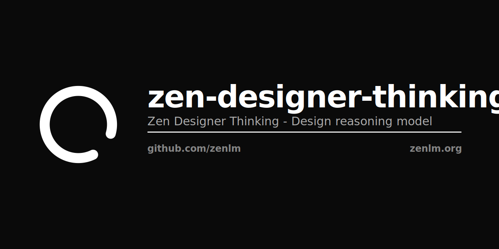

<p align="center"></p>

# Zen Designer Thinking

Chain-of-thought reasoning for visual design.

[](https://opensource.org/licenses/Apache-2.0)

## Overview

Zen Designer Thinking is a vision-language model that applies chain-of-thought reasoning to design problems. Decomposes visual design decisions into explicit reasoning steps — analyzing layout, color theory, typography, and accessibility before producing recommendations.

| Property | Value |
|----------|-------|
| Parameters | 4B |
| Context | 32K |
| Modalities | Text + Vision |
| License | Apache 2.0 |

## Usage

```python
from transformers import AutoModelForCausalLM, AutoProcessor

model = AutoModelForCausalLM.from_pretrained("zenlm/zen-designer-thinking", trust_remote_code=True)
processor = AutoProcessor.from_pretrained("zenlm/zen-designer-thinking", trust_remote_code=True)

from PIL import Image
image = Image.open("landing-page.png")

messages = [{"role": "user", "content": [
    {"type": "image"},
    {"type": "text", "text": "Think step by step: evaluate the color contrast, visual hierarchy, and accessibility of this landing page design."}
]}]

inputs = processor(images=image, text=processor.apply_chat_template(messages), return_tensors="pt")
output = model.generate(**inputs, max_new_tokens=1024)
print(processor.decode(output[0], skip_special_tokens=True))
```

## Related

- [zen-designer-instruct](https://huggingface.co/zenlm/zen-designer-instruct) — Design instruction variant
- [zen-eco-thinking](https://huggingface.co/zenlm/zen-eco-thinking) — General chain-of-thought model
- [Zen LM](https://github.com/zenlm) — Full model family

Apache 2.0 · [Zen LM](https://zenlm.org) · [Hanzo AI](https://hanzo.ai)
